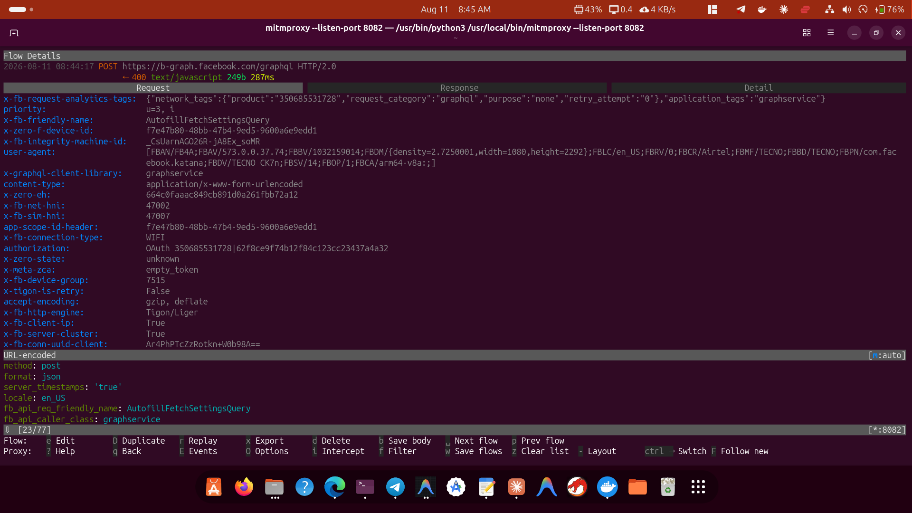

# 🔐 Facebook-SSL-Pinning-Bypass
📡 Intercept Facebook network traffic on Android device

> 💡 **GOOD NEWS:** You do **not** need a rooted device to use this! It works flawlessly on **non-rooted** devices and has been successfully tested using **Mitmproxy** in a non-root environment.

## 📌 Latest Bypassed and Tested App Details
- App version: **573.0.0.37.74**
- Architecture: **arm64-v8a, armeabi-v7a, x86, x86_64**
- Tools Used for test: [Mitmproxy](https://mitmproxy.org/), [Reqable](https://reqable.com/).
- For any inquiries, please contact me on Telegram [https://t.me/SHAJON](https://t.me/SHAJON)

## 🎥 Evidence

## ✅ Other Apps
1. [Facebook iOS](https://github.com/shajon-dev/iOS-Facebook-SSL-Pinning-Bypass)
2. [Messenger Android](https://github.com/shajon-dev/Messenger-SSL-Pinning-Bypass)
3. [Messenger iOS](https://github.com/shajon-dev/iOS-Messenger-SSL-Pinning-Bypass)
4. [Instagram Android](https://github.com/shajon-dev/Instagram-SSL-Pinning-Bypass)
5. [Instagram iOS](https://github.com/shajon-dev/iOS-Instagram-SSL-Pinning-Bypass)
6. [Threads Android](https://github.com/shajon-dev/Threads-SSL-Pinning-Bypass)
7. [Threads iOS](https://github.com/shajon-dev/iOS-Threads-SSL-Pinning-Bypass)
8. [Business Suite Android](https://github.com/shajon-dev/Meta-Business-Suit-SSL-Pinning-Bypass)
9. [Business Suite iOS](https://github.com/shajon-dev/iOS-Meta-Business-Suit-SSL-Pinning-Bypass)
10. [TikTok iOS](https://github.com/shajon-dev/iOS-TikTok-SSL-Pinning-Bypass)

## 📦 For Demo - Download Official APKs
  - For any issues, contact me on Telegram. Read [setup process](#-setup-process) carefully before use.
  - Please note that the latest version is a paid release and is not available for free download.
<table width="100%">
  <thead>
    <tr>
      <th rowspan="2" align="center">Package Name</th>
      <th rowspan="2" align="center">Version</th>
      <th rowspan="2" align="center">Status</th>
      <th rowspan="2" align="center">Non-Root</th>
      <th colspan="4" align="center">Download Link</th>
    </tr>
    <tr>
      <th align="center">arm64-v8a</th>
      <th align="center">armeabi-v7a</th>
      <th align="center">x86</th>
      <th align="center">x86_64</th>
    </tr>
  </thead>
  <tbody>
    <tr>
      <td rowspan="3" align="center"><code>com.facebook.katana</code></td>
      <td align="center">573.0.0.37.74</td>
      <td align="center">✅ Bypassed</td>
      <td align="center">✅ Yes</td>
      <td colspan="4" align="center"><a href="https://t.me/SHAJON">Contact Telegram</a></td>
    </tr>
    <tr>
      <td align="center">510.0.0.72.41</td>
      <td align="center">✅ Bypassed</td>
      <td align="center">✅ Yes</td>
      <td colspan="4" align="center"><a href="https://github.com/shajon-dev/Facebook-SSL-Pinning-Bypass/releases">Download Link</a></td>
    </tr>
    <tr>
      <td align="center">500.0.0.57.50</td>
      <td align="center">✅ Bypassed</td>
      <td align="center">✅ Yes</td>
      <td colspan="4" align="center"><a href="https://github.com/shajon-dev/Facebook-SSL-Pinning-Bypass/releases">Download Link</a></td>
    </tr>
  </tbody>
</table>

## ☕ Buy Me a Coffee

If this project helped you, consider buying me a coffee! ❤️

| Coin | Network | Address |
| :--- | :--- | :--- |
| <table border="0" cellpadding="0" cellspacing="0"><tr><td></td><td>&nbsp;<b>Binance</b></td></tr></table> | Binance Pay (UID) | <pre><code>839622149</code></pre> |
| <table border="0" cellpadding="0" cellspacing="0"><tr><td></td><td>&nbsp;<b>USDT</b></td></tr></table> | TRC20 [TRX Network] | <pre><code>TAsPdCxkX9CeErJ4vw7xBHfZDT6vpdfmwH</code></pre> |
| <table border="0" cellpadding="0" cellspacing="0"><tr><td></td><td>&nbsp;<b>ANY Crypto</b></td></tr></table> | ETH / BSC | <pre><code>0x22d4f314acbf6055b0a37df8df68f9cd40ba889a</code></pre> |
| <table border="0" cellpadding="0" cellspacing="0"><tr><td></td><td>&nbsp;<b>BTC</b></td></tr></table> | Bitcoin Network | <pre><code>14RYf4pw7v2rtttLxRch2StjFzFAn9ycCE</code></pre> |

## 📱 Requirements
1. 🔓 Rooted Android phone or Emulator with root access (LDPlayer 9 / Nox Player)
2. 🛠️ ADB tools required for real devices only. Or use [MT Manager](https://mt2.cn/) to replace the .so file on the device.
3. 🔄 Tools for traffic capture: [Mitmproxy](https://mitmproxy.org/), [Reqable](https://reqable.com/).

## 🔧 Setup Process
 1. ⬇️ **Download the patched APK** from the [GitHub Releases](https://github.com/shajon-dev/Facebook-SSL-Pinning-Bypass/releases) page, choosing the file that matches your device architecture (`arm64-v8a` / `armeabi-v7a` / `x86` / `x86_64`).
 2. 📲 **Install the APK** on your Android device (uninstall the original app first if it is already installed).
 3. 🔄 Configure a proxy and use [Mitmproxy](https://mitmproxy.org/) or [Reqable](https://reqable.com/) to capture and monitor Facebook network traffic.
 4. ✅ **No root required** — this works on non-rooted devices as well.

## 💼 Professional Services & Custom Solutions

Are you looking for the **latest patched APKs** or require specialized technical services? I offer professional, reliable solutions tailored to your needs. 

**My Expertise Includes:**
- 🔐 **SSL Pinning Bypass:** Custom bypass solutions for both Android and iOS applications.
- 🔄 **Reverse Engineering:** Comprehensive analysis and reverse engineering of any Software, Mobile App, or API.
- 🤖 **Bot Development:** Creation of advanced, automated bots for various platforms and customized use cases.

If a specific bypass is not available on my GitHub, or if you have a custom project in mind, let's connect! I am highly active and ready to discuss your requirements.

  

